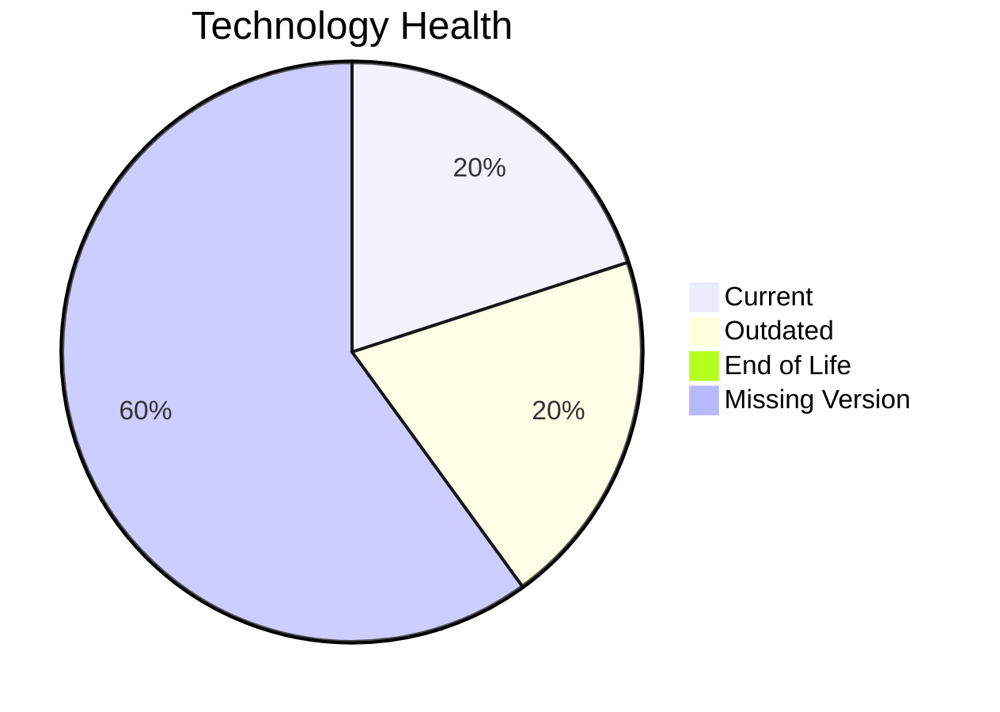

# Application Report: ERPApp-001

**ID:** app001  
**Generated:** 2026-05-26

## Overview

| Attribute | Value |
|-----------|-------|
| Owner | Finance |
| Environment | On-Premise |
| Business Criticality | High |
| Users | 350 |
| Servers | sv01, sv02 |

## Technology Stack

| Component | Technology | Version | Status |
|-----------|-----------|---------|--------|
| Operating system | AIX | AIX 7.2 | 🟡 OUTDATED |
| Database | Oracle | Oracle 19c | 🟢 CURRENT_VERSION |
| Programming language | COBOL-2014 | COBOL-2014 | ⚪ NO_KNOWLEDGE |
| Framework | unknown | unknown | ⚪ NO_KNOWLEDGE |
| Application Server | None | None | ⚪ NO_KNOWLEDGE |

## Complexity Assessment

**Score:** 7/10 — **HIGH**  
**Confidence:** 8

Technology risk score 6/10 (0 EOL, 1 outdated components), integration 6/10 (5 external interfaces), infrastructure 4/10 (2 servers, 2 environments), business criticality 9/10 (High), architecture 8/10, data complexity 7/10 (DB storage 1000 GB).

## Modernization Scenarios

### Applicable Scenarios

#### ✅ Operating System Update

- **Priority:** High
- **Effort:** Low
- **Effects:** security
- **Cost:** €1,330 (one-time)
- **Savings:** €500/year
- **Reasoning:** Operating system is outdated/EOL per technology assessment.
#### ✅ Switch to standard Linux Operating System

- **Priority:** Medium
- **Effort:** Medium
- **Effects:** agility, security, cost
- **Cost:** €399 (one-time)
- **Savings:** €400/year
- **Reasoning:** Application runs on proprietary non-Linux OS.
#### ✅ Application Migration to Cloud Infrastructure (Lift & Shift)

- **Priority:** High
- **Effort:** Low
- **Effects:** security, agility
- **Cost:** €6,650 (one-time)
- **Savings:** €2,400/year
- **Reasoning:** Application remains on-premise and can be lift-and-shift candidate.
#### ✅ Application Refactoring and De-coupling

- **Priority:** High
- **Effort:** High
- **Effects:** agility, cost, sustainability
- **Cost:** €332,502 (one-time)
- **Savings:** €120,000/year
- **Reasoning:** Architecture/complexity suggests coupling and technical debt.
#### ✅ Switch DB Engine to open-source database solution

- **Priority:** High
- **Effort:** Medium
- **Effects:** cost
- **Cost:** N/A (one-time)
- **Savings:** N/A/year
- **Reasoning:** Proprietary DB engine indicates open-source migration opportunity.
#### ✅ Update outdated components

- **Priority:** High
- **Effort:** High
- **Effects:** security, agility, cost
- **Cost:** N/A (one-time)
- **Savings:** N/A/year
- **Reasoning:** AIX 7.2 is OUTDATED per technology assessment, and COBOL-2014 is a legacy programming language. Multiple application components require updates.

### Not Applicable / Other

| Scenario | Status | Reason |
|----------|--------|--------|
| Switch to ARM-based CPU | ❓ LACK_OF_DATA | CPU architecture (x86/x64/ARM) is not provided in source data. |
| Applications Server replacement | ❌ NOT_APPLICABLE | No explicit application server technology is managed for replacement. |
| Application Containerization | 🚫 BLOCKED | Legacy Unix platform is an exclusion for containerization scenario. |
| Upgrade Legacy Databases | ✔️ FULFILLED | Database appears on supported lifecycle versions. |

## Financial Summary

| Metric | Value |
|--------|-------|
| Total One-Time Cost | €340,881 |
| Total Yearly Savings | €123,300 |
| Break-Even | 2.8 years |
