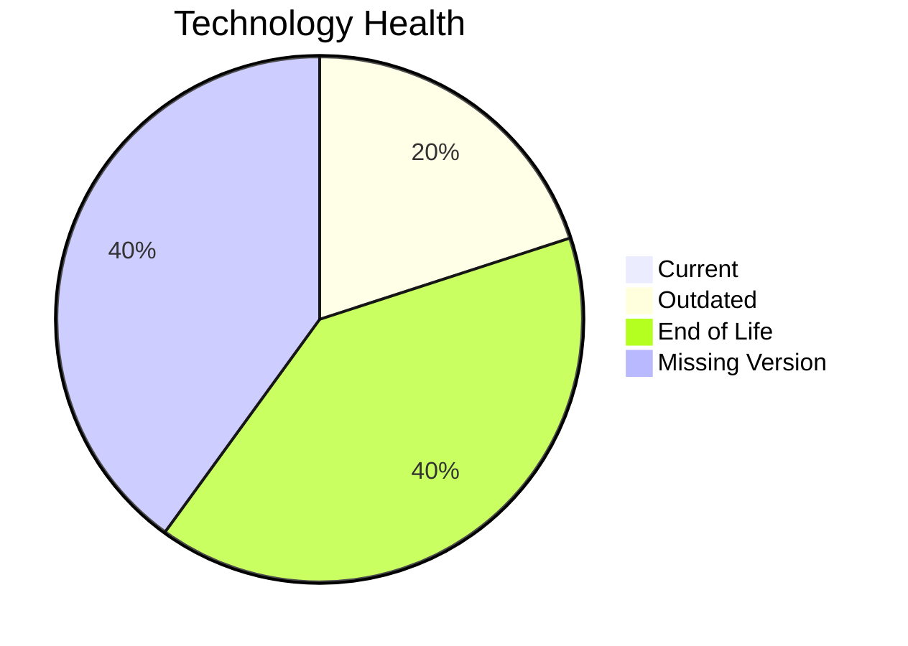

# Application Report: CRMApp-002

**ID:** app002  
**Generated:** 2026-05-26

## Overview

| Attribute | Value |
|-----------|-------|
| Owner | Marketing |
| Environment | AWS |
| Business Criticality | Medium |
| Users | 1200 |
| Servers | sv05, sv07 |

## Technology Stack

| Component | Technology | Version | Status |
|-----------|-----------|---------|--------|
| Operating system | RHEL | RHEL 7 | 🔴 EOL |
| Database | Amazon | Amazon RDS MySQL | ⚪ NO_KNOWLEDGE |
| Programming language | Java | Java 11 | 🟡 OUTDATED |
| Framework | unknown | unknown | ⚪ NO_KNOWLEDGE |
| Application Server | Websphere | Websphere 7.0 | 🔴 EOL |

## Complexity Assessment

**Score:** 7/10 — **HIGH**  
**Confidence:** 8

Technology risk score 9/10 (2 EOL, 1 outdated components), integration 8/10 (8 external interfaces), infrastructure 4/10 (2 servers, 2 environments), business criticality 6/10 (Medium), architecture 6/10, data complexity 5/10 (DB storage 500 GB).

## Modernization Scenarios

### Applicable Scenarios

#### ✅ Operating System Update

- **Priority:** High
- **Effort:** Low
- **Effects:** security
- **Cost:** €1,330 (one-time)
- **Savings:** €500/year
- **Reasoning:** Operating system is outdated/EOL per technology assessment.
#### ✅ Applications Server replacement

- **Priority:** Medium
- **Effort:** Medium
- **Effects:** agility, cost
- **Cost:** €13,300 (one-time)
- **Savings:** €9,600/year
- **Reasoning:** Application server is legacy/EOL in technology assessment.

### Not Applicable / Other

| Scenario | Status | Reason |
|----------|--------|--------|
| Switch to standard Linux Operating System | ✔️ FULFILLED | Application already runs on a standard Linux distribution. |
| Switch to ARM-based CPU | 🚫 BLOCKED | Scenario excludes 3rd-party software due architecture control constraints. |
| Application Migration to Cloud Infrastructure (Lift & Shift) | ✔️ FULFILLED | Application is already hosted on public cloud provider. |
| Application Containerization | 🚫 BLOCKED | 3rd-party runtime packaging is vendor-managed and not customer-modifiable. |
| Application Refactoring and De-coupling | 🚫 BLOCKED | 3rd-party software internals are not under customer control for refactoring. |
| Upgrade Legacy Databases | ❓ LACK_OF_DATA | Database version data is insufficient for lifecycle upgrade decision. |
| Switch DB Engine to open-source database solution | 🚫 BLOCKED | 3rd-party application stack constrains DB engine replacement. |
| Update outdated components | 🚫 BLOCKED | Component upgrades are vendor-managed for 3rd-party software. |

## Financial Summary

| Metric | Value |
|--------|-------|
| Total One-Time Cost | €14,630 |
| Total Yearly Savings | €10,100 |
| Break-Even | 1.4 years |
