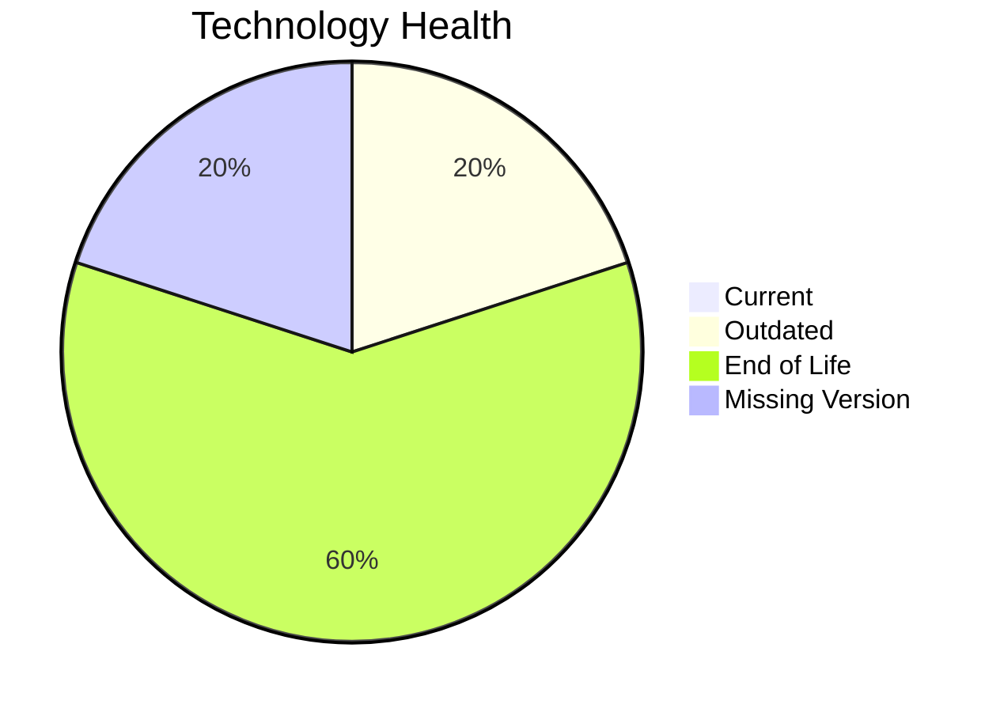

# Application Report: AnalyticsApp-003

**ID:** app003  
**Generated:** 2026-05-26

## Overview

| Attribute | Value |
|-----------|-------|
| Owner | IT |
| Environment | AWS |
| Business Criticality | Low |
| Users | 480 |
| Servers | sv03 |

## Technology Stack

| Component | Technology | Version | Status |
|-----------|-----------|---------|--------|
| Operating system | RHEL | RHEL 7 | 🔴 EOL |
| Database | PostgreSQL | PostgreSQL 13 | 🟡 OUTDATED |
| Programming language | Python | Python 3.9 | 🔴 EOL |
| Framework | unknown | unknown | ⚪ NO_KNOWLEDGE |
| Application Server | Apache Tomcat | Apache Tomcat 6.1 | 🔴 EOL |

## Complexity Assessment

**Score:** 5/10 — **MEDIUM**  
**Confidence:** 8

Technology risk score 9/10 (3 EOL, 0 outdated components), integration 5/10 (3 external interfaces), infrastructure 2/10 (1 servers, 1 environments), business criticality 3/10 (Low), architecture 4/10, data complexity 3/10 (DB storage 200 GB).

## Modernization Scenarios

### Applicable Scenarios

#### ✅ Operating System Update

- **Priority:** High
- **Effort:** Low
- **Effects:** security
- **Cost:** €1,006 (one-time)
- **Savings:** €500/year
- **Reasoning:** Operating system is outdated/EOL per technology assessment.
#### ✅ Applications Server replacement

- **Priority:** Medium
- **Effort:** Medium
- **Effects:** agility, cost
- **Cost:** €10,057 (one-time)
- **Savings:** €10,800/year
- **Reasoning:** Application server is legacy/EOL in technology assessment.
#### ✅ Upgrade Legacy Databases

- **Priority:** High
- **Effort:** Medium
- **Effects:** security, agility
- **Cost:** €10,057 (one-time)
- **Savings:** €10,000/year
- **Reasoning:** PostgreSQL 13 reaches End of Life on November 13, 2025 and is classified as OUTDATED. Upgrading to a current version (PostgreSQL 16/17) is recommended before security patches cease.
#### ✅ Update outdated components

- **Priority:** High
- **Effort:** High
- **Effects:** security, agility, cost
- **Cost:** N/A (one-time)
- **Savings:** N/A/year
- **Reasoning:** Technology assessment shows outdated or EOL language/server components.

### Not Applicable / Other

| Scenario | Status | Reason |
|----------|--------|--------|
| Switch to standard Linux Operating System | ✔️ FULFILLED | Application already runs on a standard Linux distribution. |
| Switch to ARM-based CPU | ❓ LACK_OF_DATA | CPU architecture (x86/x64/ARM) is not provided in source data. |
| Application Migration to Cloud Infrastructure (Lift & Shift) | ✔️ FULFILLED | Application is already hosted on public cloud provider. |
| Application Containerization | ✔️ FULFILLED | Application is already containerized. |
| Application Refactoring and De-coupling | ❌ NOT_APPLICABLE | No strong monolith/coupling trigger found from available architecture data. |
| Switch DB Engine to open-source database solution | ✔️ FULFILLED | Database engine is already an open-source family. |

## Financial Summary

| Metric | Value |
|--------|-------|
| Total One-Time Cost | €21,120 |
| Total Yearly Savings | €21,300 |
| Break-Even | 1.0 years |
