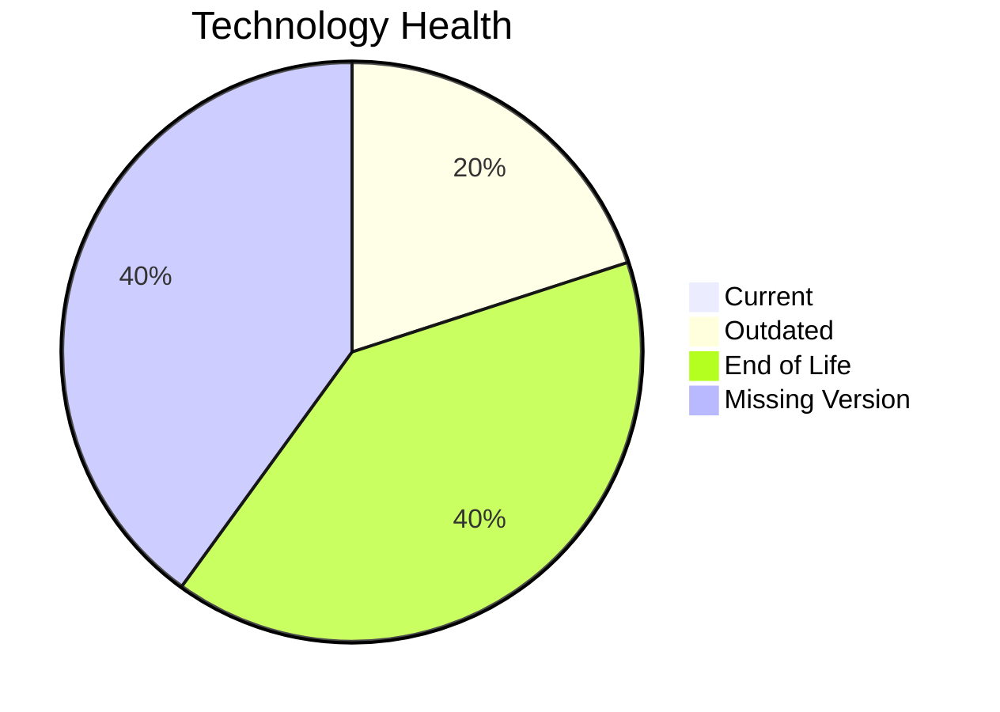

# Application Report: HRApp-004

**ID:** app004  
**Generated:** 2026-05-26

## Overview

| Attribute | Value |
|-----------|-------|
| Owner | HR |
| Environment | AWS, On-premise |
| Business Criticality | High |
| Users | 670 |
| Servers | sv06, sv02 |

## Technology Stack

| Component | Technology | Version | Status |
|-----------|-----------|---------|--------|
| Operating system | Windows | Windows Server 2012 | 🔴 EOL |
| Database | SQL | SQL Server 2019 | 🟡 OUTDATED |
| Programming language | .NET | .NET Core | ⚪ NO_KNOWLEDGE |
| Framework | unknown | unknown | ⚪ NO_KNOWLEDGE |
| Application Server | Microsoft | Microsoft IIS 8.0 | 🔴 EOL |

## Complexity Assessment

**Score:** 7/10 — **HIGH**  
**Confidence:** 8

Technology risk score 9/10 (2 EOL, 1 outdated components), integration 8/10 (6 external interfaces), infrastructure 4/10 (2 servers, 2 environments), business criticality 9/10 (High), architecture 5/10, data complexity 5/10 (DB storage 750 GB).

## Modernization Scenarios

### Applicable Scenarios

#### ✅ Operating System Update

- **Priority:** High
- **Effort:** Low
- **Effects:** security
- **Cost:** €1,330 (one-time)
- **Savings:** €500/year
- **Reasoning:** Operating system is outdated/EOL per technology assessment.
#### ✅ Applications Server replacement

- **Priority:** Medium
- **Effort:** Medium
- **Effects:** agility, cost
- **Cost:** €13,300 (one-time)
- **Savings:** €9,600/year
- **Reasoning:** Application server is legacy/EOL in technology assessment.
#### ✅ Application Refactoring and De-coupling

- **Priority:** High
- **Effort:** High
- **Effects:** agility, cost, sustainability
- **Cost:** €332,502 (one-time)
- **Savings:** €120,000/year
- **Reasoning:** Architecture/complexity suggests coupling and technical debt.
#### ✅ Upgrade Legacy Databases

- **Priority:** High
- **Effort:** Medium
- **Effects:** security, agility
- **Cost:** €13,300 (one-time)
- **Savings:** €10,000/year
- **Reasoning:** Database status is outdated or EOL in technology assessment.
#### ✅ Switch DB Engine to open-source database solution

- **Priority:** High
- **Effort:** Medium
- **Effects:** cost
- **Cost:** N/A (one-time)
- **Savings:** N/A/year
- **Reasoning:** Proprietary DB engine indicates open-source migration opportunity.
#### ✅ Update outdated components

- **Priority:** High
- **Effort:** High
- **Effects:** security, agility, cost
- **Cost:** N/A (one-time)
- **Savings:** N/A/year
- **Reasoning:** Technology assessment shows outdated or EOL language/server components.

### Not Applicable / Other

| Scenario | Status | Reason |
|----------|--------|--------|
| Switch to standard Linux Operating System | ❌ NOT_APPLICABLE | Scenario excludes Windows-based operating systems. |
| Switch to ARM-based CPU | 🚫 BLOCKED | Legacy Windows platforms are excluded for ARM migration scenarios. |
| Application Migration to Cloud Infrastructure (Lift & Shift) | ◐ PARTIALLY_FULFILLED | Application is hybrid (cloud + on-prem), partial migration already done. |
| Application Containerization | ✔️ FULFILLED | Application is already containerized. |

## Financial Summary

| Metric | Value |
|--------|-------|
| Total One-Time Cost | €360,432 |
| Total Yearly Savings | €140,100 |
| Break-Even | 2.6 years |
