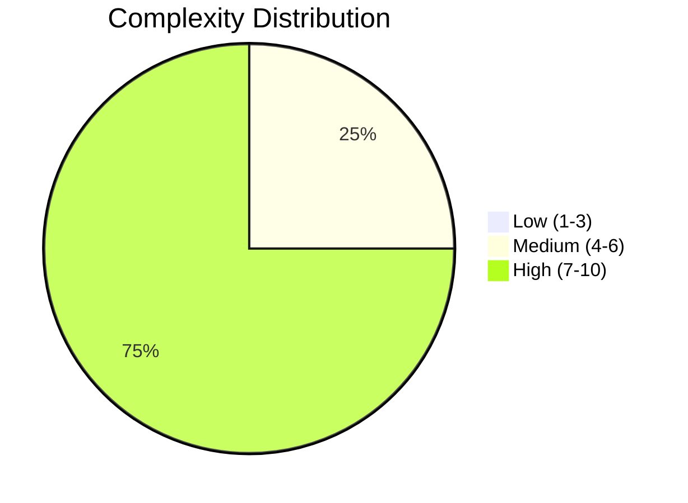
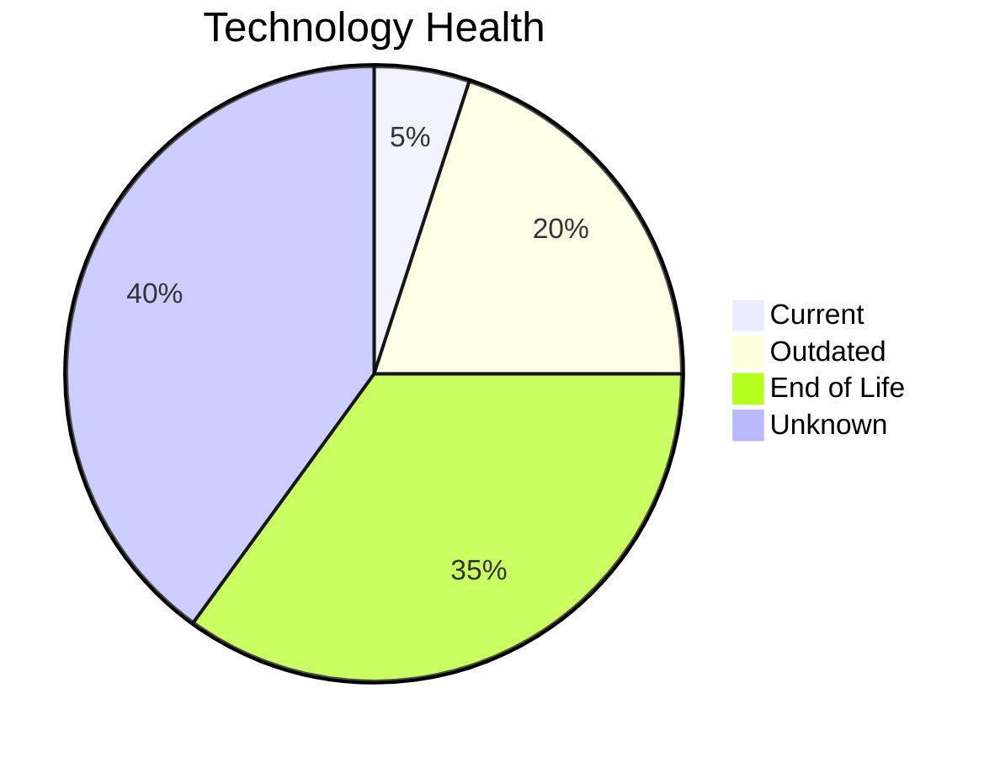
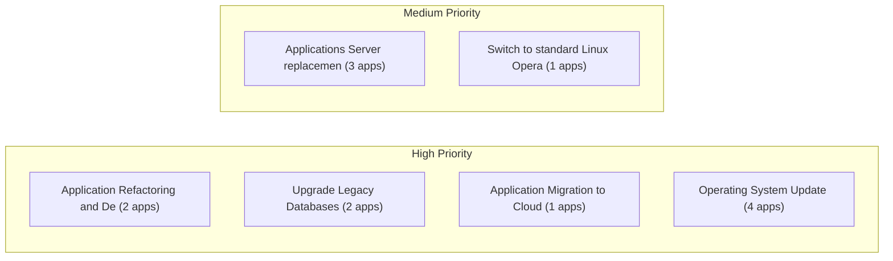
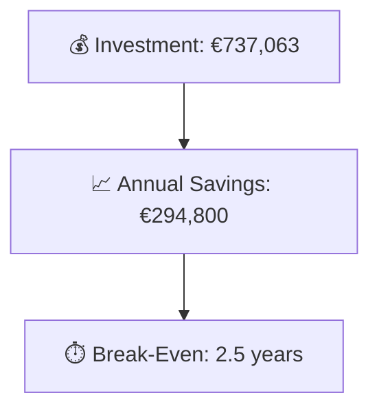

# Portfolio Modernization Report

**Generated:** 2026-05-26  
**Applications Analyzed:** 4

## Executive Summary

The portfolio contains 5 applications, of which 4 are in scope after excluding 1 retired application (EComApp-005). Key risks are concentrated across operating systems and application servers, where multiple EOL components were identified — particularly RHEL 7 (EOL June 2024), Windows Server 2012 (EOL October 2023), WebSphere 7.0, Apache Tomcat 6.1, and IIS 8.0. The most impactful modernization opportunities include Application Refactoring and De-coupling for high-complexity legacy applications, Application Server replacement across 3 in-scope apps, and database upgrades for 2 applications. The estimated total portfolio investment is €737,063 with expected annual savings of €294,800, achieving break-even in 2.5 years.

## Portfolio Overview

## Top Modernization Opportunities

| Scenario | Applicable Apps | Priority | Total Cost | Yearly Savings | ROI |
|----------|----------------|----------|------------|---------------|-----|
| Application Refactoring and De-coupling | 2 | High | €665,004 | €240,000 | 2.8y |
| Applications Server replacement | 3 | Medium | €36,657 | €30,000 | 1.2y |
| Upgrade Legacy Databases | 2 | High | €23,357 | €20,000 | 1.2y |
| Application Migration to Cloud Infrastructure (Lift & Shift) | 1 | High | €6,650 | €2,400 | 2.8y |
| Operating System Update | 4 | High | €4,996 | €2,000 | 2.5y |
| Switch to standard Linux Operating System | 1 | Medium | €399 | €400 | 1.0y |

## Scenario Applicability Matrix

| Application | OS Update | App Server Repl. | App Refactoring | Switch DB Open-Source | Update Components | Linux OS Switch | ARM CPU Switch | Cloud Migration | Containerization | DB Upgrade |
|---|:---:|:---:|:---:|:---:|:---:|:---:|:---:|:---:|:---:|:---:|
| ERPApp-001 | ✅ | ❌ | ✅ | ✅ | ✅ | ✅ | ❓ | ✅ | 🚫 | ✔️ |
| CRMApp-002 | ✅ | ✅ | 🚫 | 🚫 | 🚫 | ✔️ | 🚫 | ✔️ | 🚫 | ❓ |
| AnalyticsApp-003 | ✅ | ✅ | ❌ | ✔️ | ✅ | ✔️ | ❓ | ✔️ | ✔️ | ✅ |
| HRApp-004 | ✅ | ✅ | ✅ | ✅ | ✅ | ❌ | 🚫 | ◐ | ✔️ | ✅ |

Legend: ✅ Applicable | ❌ Not Applicable | ✔️ Already Fulfilled | 🚫 Blocked | ❓ Unknown | ◐ Partial

## Financial Summary

| Metric | Value |
|--------|-------|
| Total One-Time Investment | €737,063 |
| Total Annual Savings | €294,800 |
| Portfolio Break-Even | 2.5 years |

## Risk Applications

Applications with the highest modernization complexity or most EOL components:

| Application | Complexity | EOL Components | Applicable Scenarios |
|-------------|-----------|---------------|---------------------|
| CRMApp-002 | 7/10 (HIGH) | 2 | 2 |
| HRApp-004 | 7/10 (HIGH) | 2 | 6 |
| ERPApp-001 | 7/10 (HIGH) | 0 | 6 |
| AnalyticsApp-003 | 5/10 (MEDIUM) | 3 | 4 |

## Per-Application Reports

| Application | Report |
|-------------|--------|
| ERPApp-001 | [View Report](apps/app001.md) |
| CRMApp-002 | [View Report](apps/app002.md) |
| AnalyticsApp-003 | [View Report](apps/app003.md) |
| HRApp-004 | [View Report](apps/app004.md) |
