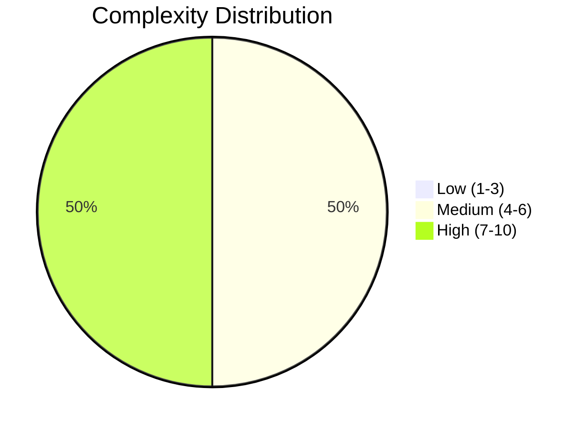
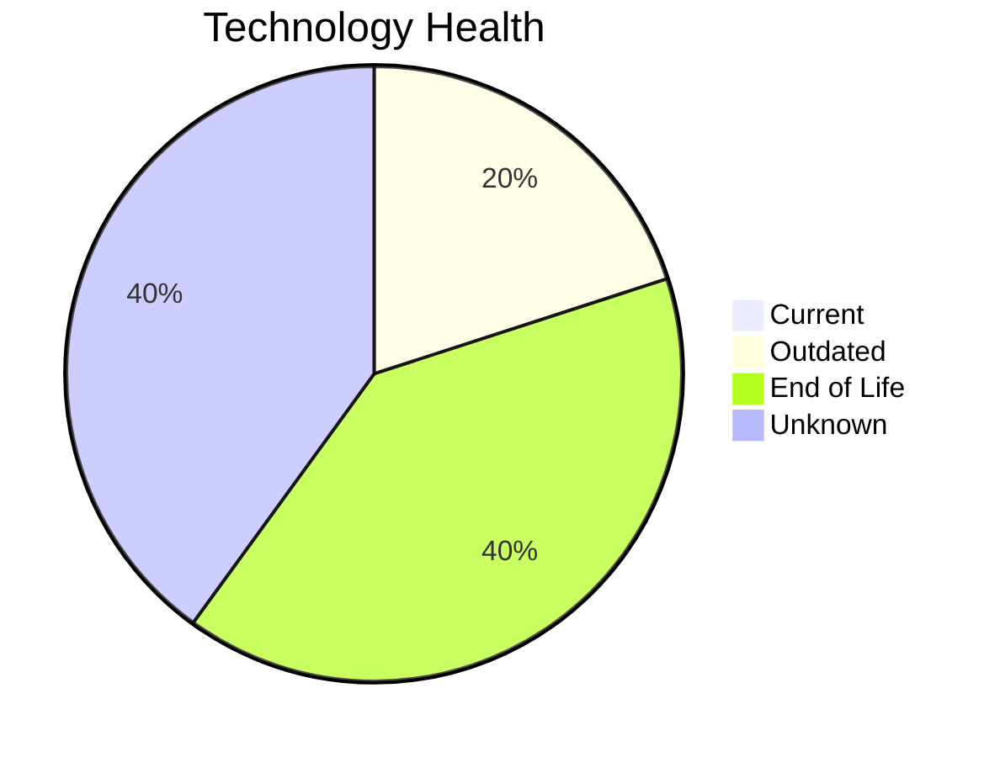
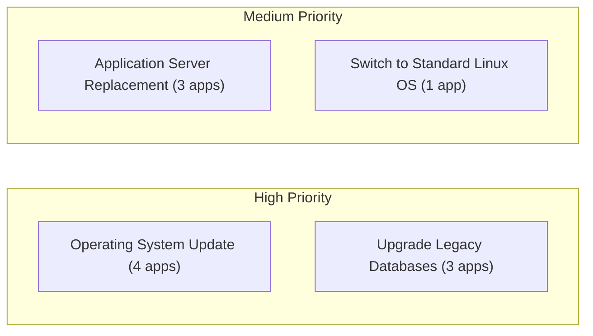
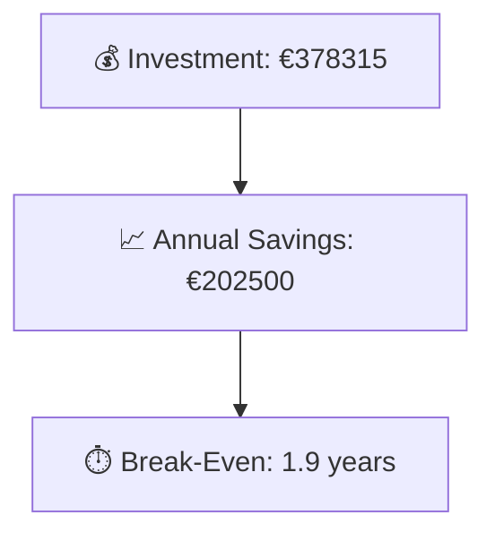

# Portfolio Modernization Report

**Generated:** 2026-07-07  
**Applications Analyzed:** 5 (4 in scope, 1 out of scope)

## Executive Summary

The portfolio contains five applications, with one retired system excluded from modernization planning.  
Across the four in-scope applications, technology risk is high: 8 components are end-of-life and none are currently classified as fully current.  
The strongest opportunities are OS remediation and database/application-server modernization, with selective cloud migration and one major refactor candidate.  
Estimated one-time investment is **€378315** with yearly savings of **€202500**, resulting in an expected break-even of **1.9 years**.  
Two applicable scenarios (`switch_db_engine_open_source`, `update_outdated_components`) were excluded from financial totals due to missing finance definitions in the provided config.

## Portfolio Overview

## Top Modernization Opportunities

| Scenario | Applicable Apps | Priority | Total Cost | Yearly Savings | ROI |
|----------|----------------:|----------|-----------:|---------------:|----:|
| Operating System Update | 4 | High | €4823 | €2000 | 2.4y |
| Switch to standard Linux Operating System | 1 | Medium | €347 | €400 | 0.9y |
| Applications Server replacement | 3 | Medium | €36657 | €30000 | 1.2y |
| Application Migration to Cloud Infrastructure (Lift & Shift) | 2 | High | €12433 | €5100 | 2.4y |
| Application Refactoring and De-coupling | 1 | High | €289133 | €135000 | 2.1y |
| Upgrade Legacy Databases | 3 | High | €34922 | €30000 | 1.2y |

## Scenario Applicability Matrix

| Application | OS Update | App Server Repl. | Cloud Lift&Shift | Upgrade DB | Switch DB to Open Source | Update Outdated Components |
|-------------|:---------:|:----------------:|:----------------:|:----------:|:------------------------:|:--------------------------:|
| ERPApp-001 | ✅ | ❌ | ✅ | ✅ | ✅ | ✅ |
| CRMApp-002 | ✅ | ✅ | ✔️ | ❓ | ✔️ | 🚫 |
| AnalyticsApp-003 | ✅ | ✅ | ✔️ | ✅ | ✔️ | ✅ |
| HRApp-004 | ✅ | ✅ | ✅ | ✅ | ✅ | ✅ |

Legend: ✅ Applicable | ❌ Not Applicable | ✔️ Already Fulfilled | 🚫 Blocked | ❓ Unknown

## Financial Summary

| Metric | Value |
|--------|------:|
| Total One-Time Investment | €378315 |
| Total Annual Savings | €202500 |
| Portfolio Break-Even | 1.9 years |

## Risk Applications

Applications with the highest modernization complexity and/or EOL exposure:

| Application | Complexity | EOL Components | Applicable Scenarios |
|-------------|-----------:|---------------:|---------------------:|
| CRMApp-002 | 7/10 (HIGH) | 2 | 2 |
| HRApp-004 | 7/10 (HIGH) | 2 | 6 |
| AnalyticsApp-003 | 5/10 (MEDIUM) | 4 | 4 |

## Per-Application Reports

| Application | Report |
|-------------|--------|
| ERPApp-001 | [View Report](apps/app001.md) |
| CRMApp-002 | [View Report](apps/app002.md) |
| AnalyticsApp-003 | [View Report](apps/app003.md) |
| HRApp-004 | [View Report](apps/app004.md) |
