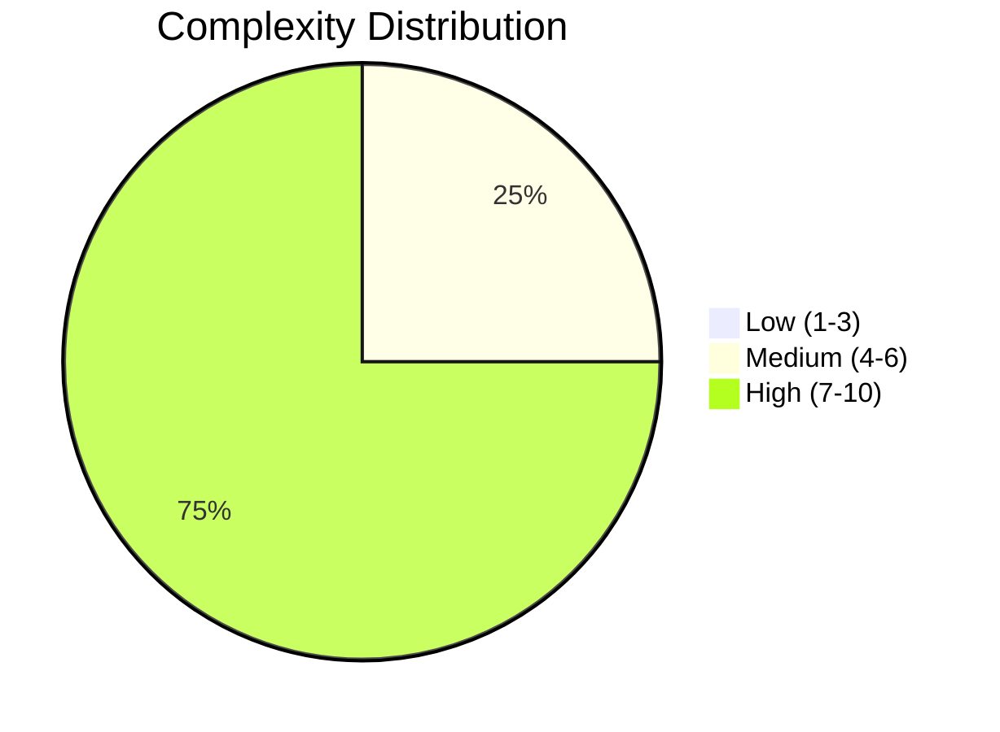
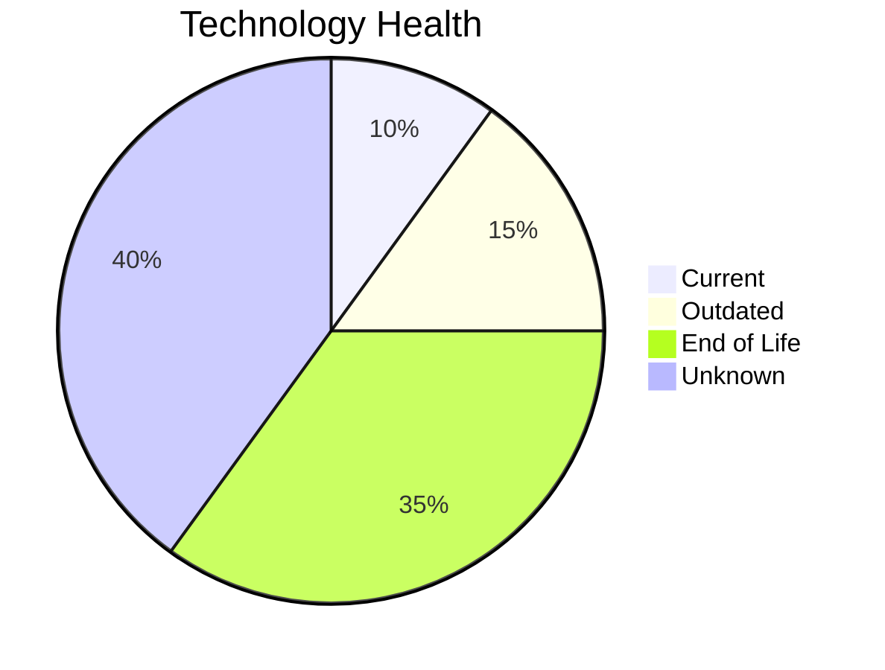
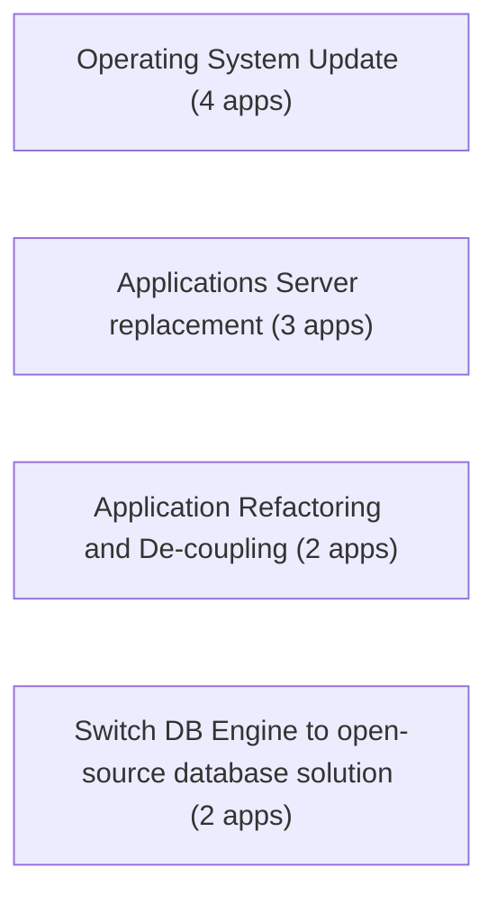
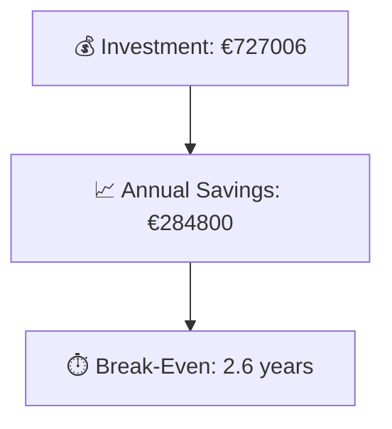

# Portfolio Modernization Report

**Generated:** 2026-05-26  
**Applications Analyzed:** 4

## Executive Summary

The portfolio contains 5 applications, with 4 in scope after exclusions. Key risks are concentrated in operating systems and application servers, where multiple EOL findings were identified. The most frequent modernization opportunities are Operating System Update, Applications Server replacement, Application Refactoring and De-coupling. Estimated portfolio investment is €727006 with yearly savings of €284800 and an expected break-even of 2.6 years.

## Portfolio Overview

## Top Modernization Opportunities

| Scenario | Applicable Apps | Priority | Total Cost | Yearly Savings | ROI |
|----------|----------------|----------|------------|---------------|-----|
| Application Migration to Cloud Infrastructure (Lift & Shift) | 1 | High | €6650 | €2400 | 2.8y |
| Application Refactoring and De-coupling | 2 | High | €665004 | €240000 | 2.8y |
| Applications Server replacement | 3 | Medium | €36657 | €30000 | 1.2y |
| Operating System Update | 4 | High | €4996 | €2000 | 2.5y |
| Switch to standard Linux Operating System | 1 | Medium | €399 | €400 | 1.0y |
| Upgrade Legacy Databases | 1 | High | €13300 | €10000 | 1.3y |

## Scenario Applicability Matrix

| Application | Operating System Update | Applications Server replacement | Application Refactoring and De-coupling | Switch DB Engine to open-source database solution | Update outdated components | Switch to standard Linux Operating System |
|---|---|---|---|---|---|---|
| ERPApp-001 | ✅ | ❌ | ✅ | ✅ | ✔️ | ✅ |
| CRMApp-002 | ✅ | ✅ | 🚫 | 🚫 | 🚫 | ✔️ |
| AnalyticsApp-003 | ✅ | ✅ | ❌ | ✔️ | ✅ | ✔️ |
| HRApp-004 | ✅ | ✅ | ✅ | ✅ | ✅ | ❌ |

Legend: ✅ Applicable | ❌ Not Applicable | ✔️ Already Fulfilled | 🚫 Blocked | ❓ Unknown | ◐ Partial

## Financial Summary

| Metric | Value |
|--------|-------|
| Total One-Time Investment | €727006 |
| Total Annual Savings | €284800 |
| Portfolio Break-Even | 2.6 years |

## Risk Applications

| Application | Complexity | EOL Components | Applicable Scenarios |
|-------------|-----------|---------------|---------------------|
| HRApp-004 | 7/10 (HIGH) | 2 | 6 |
| CRMApp-002 | 7/10 (HIGH) | 2 | 2 |
| ERPApp-001 | 7/10 (HIGH) | 0 | 5 |
| AnalyticsApp-003 | 5/10 (MEDIUM) | 3 | 3 |

## Per-Application Reports

| Application | Report |
|-------------|--------|
| ERPApp-001 | [View Report](apps/app001.md) |
| CRMApp-002 | [View Report](apps/app002.md) |
| AnalyticsApp-003 | [View Report](apps/app003.md) |
| HRApp-004 | [View Report](apps/app004.md) |
